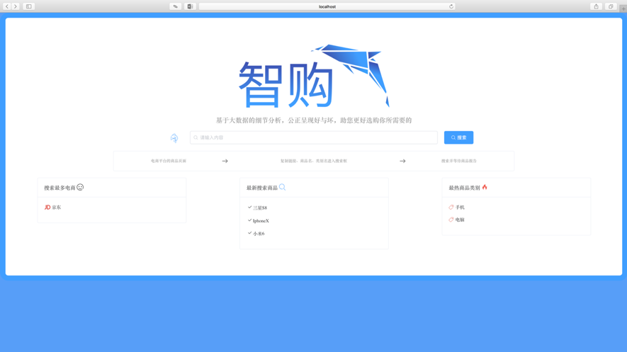
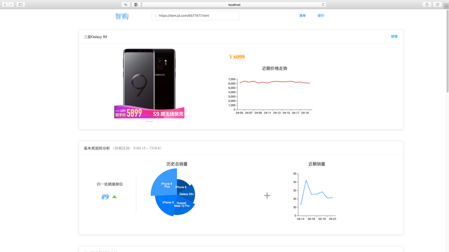
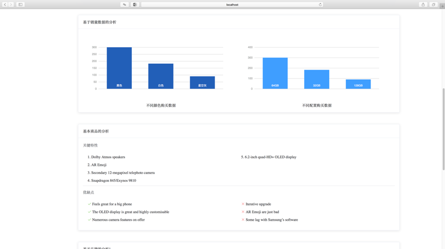
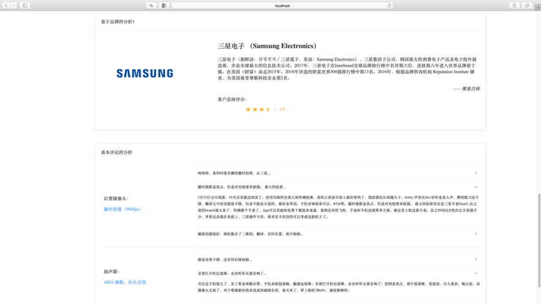
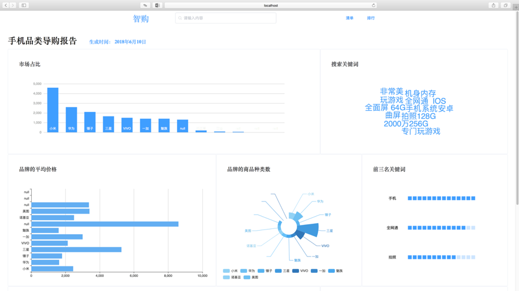

# Analyst
Analyst is a machine learning based commodity big data analysis platform. When you're shopping, simply copy the link to the Analyst and you'll know everything you want to know. But it is just an entry, and finally we won the Bronze Award.

## ScreenShot
















## How to use

1. Clone from github.com:

```shell
git clone git@github.com:kastnerorz/analyst.git
```

### Running directly

2. Init and install dependencies：

```shell
cd analyst
nvm install
```

3. Run Analyst：

```shell
java -jar analyst.jar \
--spring.datasource.url=YOUR_DATABASE_URL \
--spring.datasource.username=YOUR_DATABASE_USERNAME \
--spring.datasource.password=YOUR_DATABASE_PASSWORD
```

4. Open http://localhost:8080

### Using Docker

2. Build docker image:

```shell
mvn package -Dmaven.test.skip=true dockerfile:build
```

3. Run Analyst:

```shell
docker run --name oj -p 8081:8081 -d kastnerorz/oj
```

4. Open http://localhost:8081
